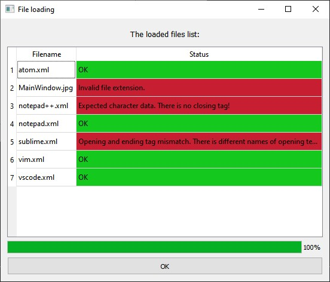

# XMLReader

### Description:

This application just work with SQLite database in real time and parse parce folder with .xml files ([like this](TextFolder/)).

Work with database and .xml files takes place in a different threads.

### Screenshots:

Main window:

  

Window with the statuses of parsing .xml files:

  

### Schemes:

The schemes of relationships between objects:

  

The scheme of function callings and emites:

  

